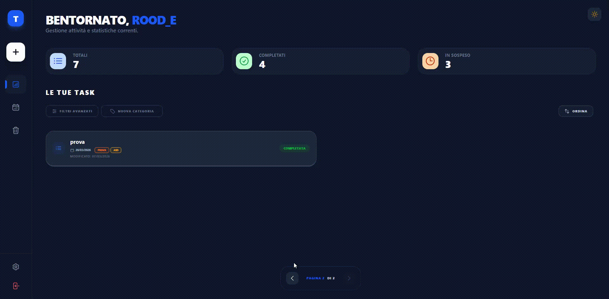
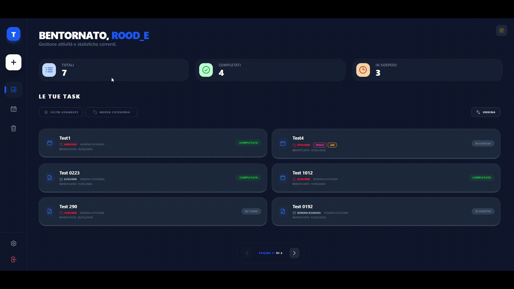

# 📝 TaskMaster - Full Stack Task Management System

[](https://www.python.org/)
[](https://www.djangoproject.com/)
[](https://reactjs.org/)
[](https://opensource.org/licenses/MIT)

TaskMaster è un ecosistema avanzato per la gestione della produttività che combina la potenza di **Django REST Framework** con la reattività di **React**. Progettato con un'architettura containerizzata, offre un'esperienza fluida per la gestione di note rich-text, checklist dinamiche e scadenze, garantendo la massima sicurezza dei dati.

---

## 🖼️ Preview
<table>
  <tr>
    <td><b>Dashboard & Calendar</b></td>
    <td><b>Rich-Text Editor</b></td>
  </tr>
  <tr>
    <td></td>
    <td></td>
  </tr>
</table>

---

## 🚀 Caratteristiche Principali

### 🎨 Frontend (React + Tailwind CSS)
* **Editor Rich-Text:** Integrazione avanzata con Tiptap (H1, H2, liste, citazioni).
* **Visualizzazione Calendario:** FullCalendar per una gestione temporale visiva e intuitiva.
* **Checklist Dinamiche:** Liste di controllo con persistenza dati in formato JSON.
* **Dashboard Intelligente:** Filtraggio in tempo reale per Stato, Categoria e Tipologia.
* **Multi-Tab Synchronization:** Sincronizzazione in tempo reale degli stati di autenticazione tra più schede aperte tramite `StorageEvent`.
* **UI/UX Moderna:** Supporto nativo Dark Mode e design responsive.

### ⚙️ Backend (Django REST Framework)
* **Isolamento Multi-Tenant:** Logica di filtraggio rigorosa; ogni utente accede esclusivamente ai propri record (**Zero-Leakage**).
* **Soft Delete:** Sistema di "Cestino" che permette il ripristino o l'eliminazione definitiva.
* **Ottimizzazione Query:** Utilizzo di `prefetch_related` per risolvere il problema **N+1**.
* **Sicurezza:** Validazione Cross-User contro attacchi **IDOR** e parametri `write_only` nei Serializer.

---

## 🛠️ Tech Stack

| Strato | Tecnologie |
| :--- | :--- |
| **Frontend** | React 18, Tailwind CSS, FullCalendar, Tiptap, Framer Motion, Axios |
| **Backend** | Python 3.12, Django 5.x, Django REST Framework |
| **Database** | PostgreSQL (Production), SQLite (Dev) |
| **DevOps** | Docker, Docker Compose |

---

## 🐳 Setup con Docker (Consigliato)

1.  **Clona il repository:**
    ```bash
    git clone [https://github.com/Rood-e/TaskMaster.git](https://github.com/Rood-e/TaskMaster.git)
    cd TaskMaster
    ```

2.  **Configura le variabili d'ambiente:**
    Crea un file `.env` nella root del progetto (usa `.env.example` come traccia).

3.  **Avvio Rapido:**
    ```bash
    docker-compose up --build
    ```

4.  **Endpoint:**
    * **Frontend:** `http://localhost:5173`
    * **API Backend:** `http://localhost:8000/api/`
    * **Admin Django:** `http://localhost:8000/admin/`

---

## 🔌 API Reference (Esempi)

| Metodo | Endpoint | Descrizione | Autenticazione |
| :--- | :--- | :--- | :--- |
| `GET` | `/api/tasks/` | Lista task dell'utente loggato | Session Cookie |
| `POST` | `/api/tasks/` | Crea una nuova task | Session Cookie + CSRF |
| `PATCH` | `/api/tasks/{id}/` | Aggiornamento parziale / Soft Delete | Session Cookie + CSRF |
| `GET` | `/api/categories/` | Lista categorie filtrate per utente | Session Cookie |
| `GET` | `/api/user/me/` | Endpoint permissivo per il check dello stato | Nessuna (Non-blocking) |

---


## 🛡️ Sicurezza e Integrità

* **Autenticazione Stateful (Session-Based):** Il sistema utilizza un flusso di autenticazione a sessioni sicuro. I token di sessione sono memorizzati in cookie protetti con flag `HttpOnly` e `SameSite=Lax`, blindando l'applicazione contro attacchi **XSS** (Cross-Site Scripting).
* **Protezione CSRF Avanzata:** Tutte le richieste di scrittura (`POST`, `PUT`, `PATCH`, `DELETE`) sono protette da middleware CSRF. Il frontend gestisce l'allineamento tramite un intercettore Axios personalizzato che popola l'header `X-CSRFToken`.
* **Validazione Cross-User:** Protezione lato server contro attacchi **IDOR** (Insecure Direct Object Reference). Ogni richiesta verifica che l'oggetto appartenga all'utente autenticato.
* **Password Security:** Utilizzo di parametri `write_only` nei Serializer per evitare leak di dati sensibili nelle risposte JSON.
* **Data Persistence:** Gestione dei volumi Docker e integrazione in produzione con database PostgreSQL gestiti in cloud (Aiven) per garantire la persistenza dei dati.

---

## 🛠️ Limitazioni Attuali e Roadmap (Future Features)

Essendo TaskMaster in fase di sviluppo attivo, sono state identificate le seguenti aree di miglioramento e funzionalità pianificate:

* **Notifiche Push & WebSocket:** Integrazione con Django Channels per notifiche in tempo reale sulla scadenza dei task senza necessità di refresh.
* **Condivisione Task:** Sviluppo di un sistema di permessi per consentire la collaborazione e la condivisione di specifiche liste di task tra utenti diversi.
---

## 👨‍💻 Autore

**Rudy Martucci Ortega**
* **GitHub:** [@Rood-e](https://github.com/Rood-e)
* **LinkedIn:** [Rudy Martucci Ortega](https://www.linkedin.com/in/rudy-martucci-ortega-891b96299/)

---
*TaskMaster - Sviluppato per una gestione task professionale e sicura.*